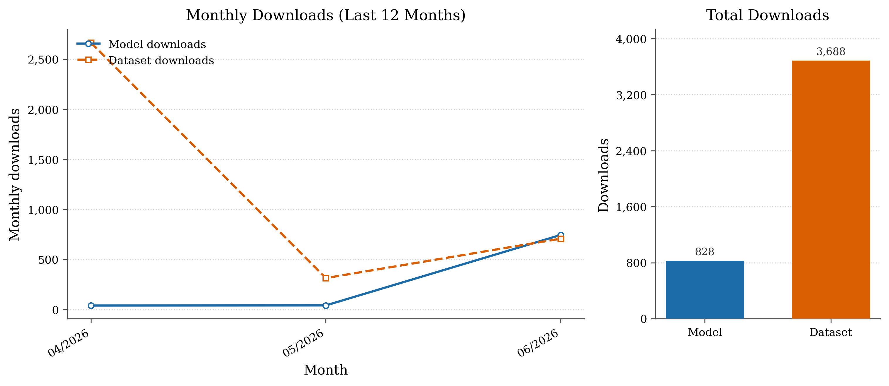

## Hey !

I'm YDX, Joint Doctoral Program between University of Electronic Science and Technology of China and SII.

-   :hammer_and_pick: DNAFM / Protein structure / Medical multi-agent
-   :pencil2: [PyTorch](https://pytorch.org/docs/stable/index.html) / [Unity3D](https://docs.unity.cn/cn/current/Manual/index.html) / [Android](https://developer.android.google.cn/) / [Python](https://www.python.org/) / [TensorFlow](https://tensorflow.google.cn/)
-   :seedling: Taking courses & doing assignments at UESTC 
-   :man: Pronouns: he/him
-   :thought_balloon: Ask me anything at [Issues](https://github.com/QIANJINYDX/QIANJINYDX/issues)!
-   Hugging Face: 
---

